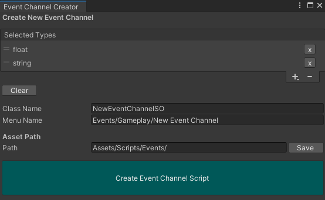

# Event System

An Event System using ScriptableObjects as event channels. Scripts with the same event channel can Invoke / Listen to these connected events to react accordingly without the need of a direct reference. This package was inspired by one of Unity's Open Projects and [this article](https://unity.com/how-to/architect-game-code-scriptable-objects).

## Installation

1. In Unity, from the package manager, click the `+` icon
2. Select `Add package from git URL...`.
3. In the text box that appears, enter this projects git url `https://github.com/FelixBole/event-system.git` 
4. That's it !

## Benefits

- Cross-scene events
- Remove the need for Singletons
- Easy search of which component uses what event by searching for references in scenes on a scriptable object event
- Streamlining complex event channel creation

## Usage
This event system comes with pre-existing event channels out of the box to streamline implementation of events that are regularly used.

### Primitives Event Channels

Available under "Create/Events/Primitives"

* Bool
* Float
* Int
* String

### Unity Based Event Channels

Available under "Create/Events/Gameplay"

* AudioClip
* Collider
* GameObject
* MonoBehaviour
* Object
* Quaternion
* Rigidbody
* Scene
* ScriptableObject
* Sprite
* Texture
* Transform
* Vector2
* Vector3

## Custom Event Creator
The custom event creator window helps to esaily and quickly create new event channels for custom classes or any combination of custom classes and pre-supported classes to create more complex events.

> The editor window is available under "Slax/Event System/Event Channel Creator"

